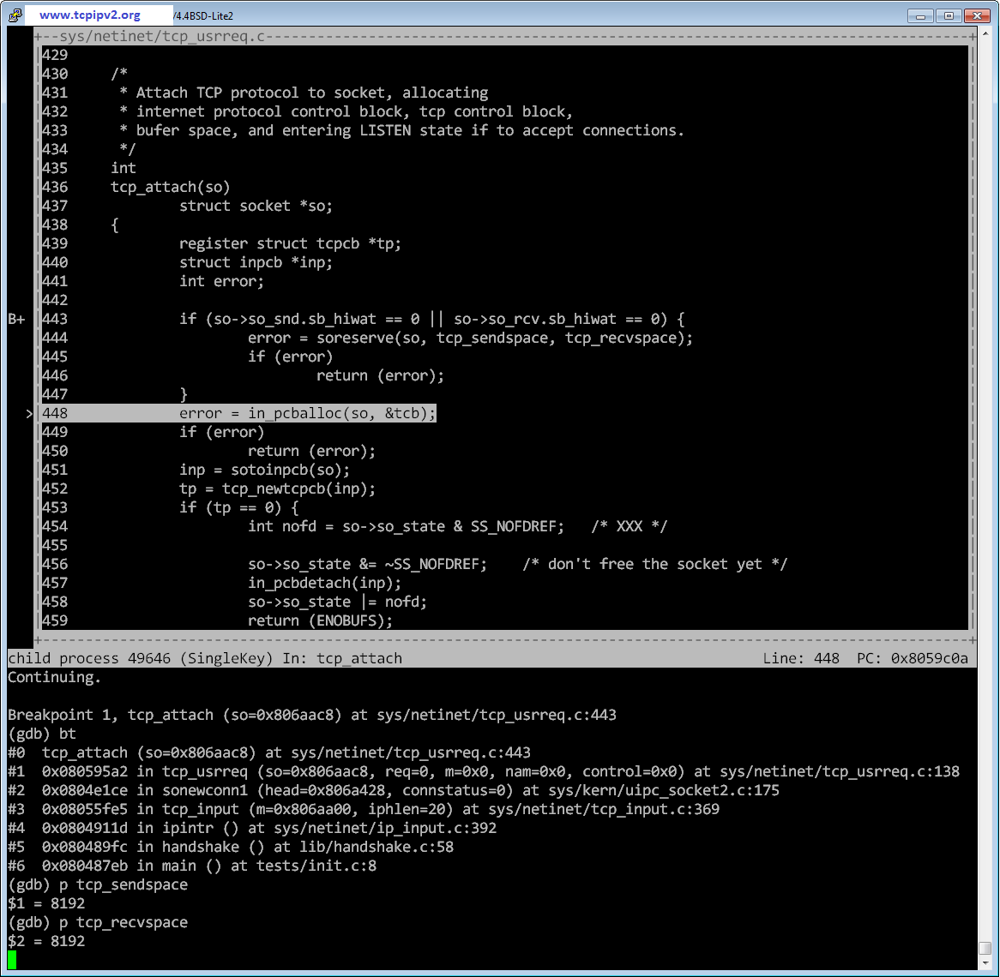

<h1>Unofficial companion site of <i>TCP/IP Illustrated, Volume 2: The Implementation</i></h1>

_TCP/IP Illustrated, Volume 2: The Implementation_ is written by
Gary R. Wright and W. Richard Stevens, published in 1995.
[Official book page](http://www.kohala.com/start/tcpipiv2.html)

This book presents the TCP/IP stack of 4.4BSD-Lite.

This site is based on a slightly newer version: 4.4BSD-Lite2.

## Run TCP/IP stack of 4.4BSD-Lite2

On Linux,
```bash
$ git clone https://github.com/chenshuo/4.4BSD-Lite2.git
$ cd 4.4BSD-Lite2
$ ./build.sh
```

This build three executables:

- `objs/test_init`  TCP three-way handshake, you can step through code with `GDB`,
    or check the [calltree](calltree/init.html)
- `objs/test_pigeon`  ICMP echo request/response
- `objs/test_tun`  Connect to host with TAP/TUN device

## Calltree of TCP three-way handshaking
[calltree](calltree/init.html)

## GDB session of TCP three-way handshaking


[Source of this site is on GitHub](http://github.com/chenshuo/tcpipv2)
