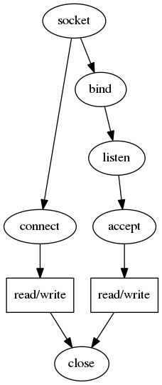

# Ch. 15 Sockets API




We directly programming with `struct socket`, bypassing the `proc` and `file` `struct`s.

To step through the code, run `gdb objs/test_init`, then set break points on `socreate`, `sobind`, etc.

## `socket()`

```c
int socket(int domain, int type, int protocol);

int sockfd = socket(AF_INET, SOCK_STREAM, 0);

socket(AF_INET, SOCK_STREAM, 0)
  -> syscall -> socket
    -> socreate(AF_INET, aso = &so, SOCK_STREAM, 0)
      struct protosw *prp = pffindtype(AF_INET, SOCK_STREAM);
      struct socket *so = malloc();
      prp->pr_usrreq(so, PRU_ATTACH, ...) -> tcp_usrreq(so, PRU_ATTACH, ...)
        -> tcp_attach(so)
          -> soreserve(so, tcp_sendspace=8192, tcp_recvspace=8192)
            -> sbreserve(&so->so_snd, tcp_sendspace=8192)
            -> sbreserve(&so->so_rcv, tcp_recvspace=8192)
          -> in_pcballoc(so, &tcb)
          -> struct inpcb *inp = sotoinpcb(so)
          -> struct tcpcb *tp = tcp_newtcpcb(inp)
          -> tp->t_state = TCPS_CLOSED;
      *aso = so
```

## `connect()`
```
connect()  // connect to 127.0.0.1:1234
  -> syscall -> connect
    -> soconnect(struct socket *so, struct mbuf *nam)
      so->so_proto->pr_usrreq(so, PRU_CONNECT, NULL, nam, NULL) -> tcp_usrreq(so, PRU_CONNECT, ...)
        if (inp->inp_lport == 0) in_pcbbind(inp, NULL)  // common unless bind() already
        -> in_pcbconnect(inp, nam)
          -> rtalloc
        tp->t_template = tcp_template(tp)
        soisconnecting(so)
        tp->t_state = TCPS_SYN_SENT;
        -> tcp_sendseqinit(tp)
        -> tcp_output(tp)  // send SYN
          -> in_cksum()
          -> ip_output()
            -> in_cksum()
            -> ifp->if_output() -> looutput()
```

## `bind()`

```
bind()  // bind on 0.0.0.0:1234
  -> syscall -> bind
    -> sobind(struct socket *so, struct mbuf *nam)
      so->so_proto->pr_usrreq(so, PRU_BIND, NULL, nam, NULL) -> tcp_usrreq(so, PRU_BIND, ...)
        -> in_pcbbind(inp, nam)
```

## `listen()`

```
listen()  // backlog = 5
  -> syscall -> listen
    -> solisten(struct socket *so, int backlog)
      so->so_proto->pr_usrreq)(so, PRU_LISTEN, ...) -> tcp_usrreq(so, PRU_LISTEN, ...)
        if (inp->inp_lport == 0) in_pcbbind(inp, NULL)  // uncommon, because bind() already
        tp->t_state = TCPS_LISTEN;
      so->so_options |= SO_ACCEPTCONN
      so->so_qlimit = min(backlog, SOMAXCONN)
```

## `accept()`

## `close()`
